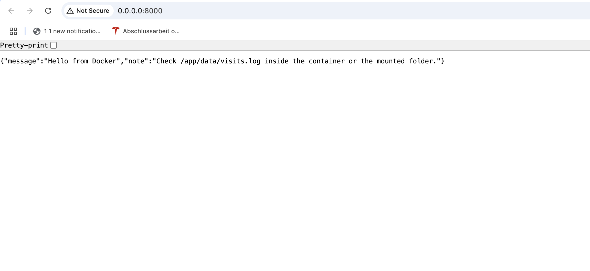

# docker learn by doing

A simple project to learn Docker by doing.  
This example uses a small Python app to explain how to build Docker images, run containers, map ports, use environment variables, and persist data with volumes.

---

## Project Structure

```
docker-basics-101/
│
├── app.py              # FastAPI app with one endpoint
├── requirements.txt    # Python dependencies
├── Dockerfile          # Instructions to build the image
├── .dockerignore       
└── README.md           
```

---

## What the App Does

- Starts a FastAPI web server  
- Displays a message (customizable with an environment variable)  
- Logs every visit into `data/visits.log` using a mounted volume  

Once running, open: [http://localhost:8000](http://localhost:8000)

---

## Why Docker?

- Solves the "works on my machine" problem  
- Provides the same setup across laptops, servers, and CI/CD pipelines  
- Isolates dependencies from your local environment  
- Makes it easy to run and scale multiple services  
- Widely used in Data/AI projects (dbt, Spark, Airflow, ML models, etc.)  

---

## Key Docker Concepts

- **Image** – The blueprint built from the Dockerfile  
- **Container** – A running instance of an image  
- **Port mapping** – Connects the container port to your machine (`-p 8000:8000`)  
- **Environment variables** – Configure runtime values (`-e APP_MESSAGE=...`)  
- **Volumes** – Store data outside the container (`-v ./data:/app/data`)  

---

## Step 1: Build the Image

Run this command in the project folder:

```bash
docker build -t docker-learn-by-doing .
```

---

## Step 2: Run the Container

**On Mac/Linux:**

```bash
docker run -p 8000:8000 --name docker-basics   -e APP_MESSAGE="Hello from Docker"   -v $(pwd)/data:/app/data   docker-learn-by-doing
```


Now open: [http://localhost:8000](http://localhost:8000)



---

## Useful Docker Commands

```bash
docker ps                 # list running containers
docker ps -a              # list all containers
docker images             # list available images
docker logs -f <id>       # view logs of a container
docker exec -it <id> sh   # open a shell inside a container
docker stop <id>          # stop a container
docker rm <id>            # remove a stopped container
docker rmi <image>        # remove an image
docker system prune       # clean up unused containers/images (caustion adviced)
```

---

## Workflow Diagram

```
Dockerfile  --->  Image  --->  Container
                          | 
                          |---> Port mapping (-p)
                          |---> Environment variables (-e)
                          |---> Volume mounts (-v)
```

---

## Next Steps

- Add a database container (e.g., Postgres) and connect the app to it  
- Use `.env` files to manage environment variables  
- Try multi-stage builds to optimize image size  
- Run containers as non-root users for better security  

---

## Some quick notes 

This project is a beginner-friendly and help with basic setup and commands.  
Experiment, try commands, and once you are comfortable, move on to more advanced Docker and data/AI use cases.
